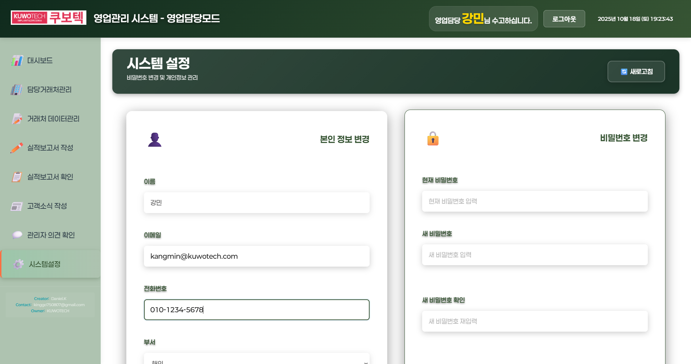

# KUWOTECH 영업관리 시스템 - 영업담당모드 사용자 매뉴얼

**작성일:** 2025년 10월 18일
**대상:** 영업담당 직원
**시스템:** KUWOTECH 영업관리 시스템

---

## 목차

1. [로그인](#1-로그인)
2. [대시보드](#2-대시보드)
3. [담당거래처관리](#3-담당거래처관리)
4. [거래처 데이터관리](#4-거래처-데이터관리)
5. [실적보고서 작성](#5-실적보고서-작성)
6. [실적보고서 확인](#6-실적보고서-확인)
7. [고객소식 작성](#7-고객소식-작성)
8. [관리자 의견 확인](#8-관리자-의견-확인)
9. [시스템설정](#9-시스템설정)

---

## 1. 로그인

### 사용 목적
영업관리 시스템에 접속하여 본인 계정으로 로그인합니다.

### 페이지 유형
**입력 페이지**

### 사용 방법

1. **성명 입력**
   - 로그인 페이지에서 본인의 성명을 입력합니다.
   - 입력 후 Enter 키를 누르거나 입력란에서 포커스를 이동합니다.

2. **역할 확인**
   - 시스템이 자동으로 귀하의 역할을 확인합니다.
   - 단일 역할인 경우: 자동으로 선택되어 표시됩니다.
   - 복수 역할인 경우: 원하는 역할을 선택할 수 있습니다.

3. **비밀번호 입력**
   - 비밀번호 입력란에 비밀번호를 입력합니다.
   - 초기 비밀번호는 관리자가 설정한 값입니다.

4. **로그인**
   - "확인" 버튼을 클릭하여 로그인합니다.
   - 중복 로그인 시 기존 세션 종료 여부를 선택할 수 있습니다.

### 주의사항
- 로그인 실패 시 성명, 역할, 비밀번호를 다시 확인해주세요.
- 비밀번호를 잊으신 경우 관리자에게 문의하세요.
- 퇴사한 직원은 로그인할 수 없습니다.

---

## 2. 대시보드

### 사용 목적
개인 영업 실적 현황을 한눈에 확인할 수 있는 KPI 대시보드입니다.

### 페이지 유형
**조회 전용 페이지**

---

### 📊 대시보드 보는 방법

#### 1단계: 대시보드 접속
- 로그인 후 자동으로 대시보드가 표시됩니다.
- 또는 좌측 사이드바에서 "📊 대시보드" 메뉴를 클릭합니다.

*▲ 대시보드 전체 화면 - 4개 섹션으로 구성된 KPI 카드들을 확인할 수 있습니다*

#### 2단계: KPI 카드 확인
대시보드는 4개의 주요 섹션으로 구성되어 있습니다:

---

### 📊 거래처 관리 지표 (섹션 1)

이 섹션에서 담당 거래처 현황을 확인할 수 있습니다.

**🏢 담당 거래처**
- **의미**: 배정받은 거래처 수 (불용 제외)
- **보는 방법**: 큰 숫자로 표시된 거래처 수를 확인합니다.
- **활용**: 자신이 담당하는 거래처가 몇 개인지 파악합니다.
- **전월 대비**: ▲ 또는 ▼ 아이콘과 함께 증감율이 표시됩니다.

**✅ 활성 거래처**
- **의미**: 현재 활발히 거래 중인 거래처 수
- **보는 방법**: 녹색으로 강조된 숫자를 확인합니다.
- **활용**: 실제로 매출이 발생하는 거래처 수를 파악합니다.

**📊 거래처 활성화율**
- **의미**: (활성거래처 ÷ 담당거래처) × 100
- **보는 방법**: 퍼센트(%) 값을 확인합니다.
- **목표**: 80% 이상 유지가 바람직합니다.
- **활용**: 거래처 관리 효율성을 평가합니다.

**⭐ 주요제품 판매 거래처**
- **의미**: 주요제품을 구매한 거래처 수
- **보는 방법**: 별 아이콘과 함께 표시된 숫자를 확인합니다.
- **활용**: 핵심 제품 판매 현황을 파악합니다.

---

### 🎯 거래처확보 목표 달성지표 (섹션 2)

**🎯 회사배정기준 대비 달성율**
- **계산식**: ((담당거래처 ÷ 80) - 1) × 100
- **보는 방법**:
  - 양수(+): 목표 초과 달성 (파란색)
  - 음수(-): 목표 미달 (빨간색)
- **목표**: 80개사 이상 확보
- **활용**: 회사 기대치 대비 달성 수준을 파악합니다.

**🏆 주요고객처 목표 달성율**
- **계산식**: ((주요제품판매거래처 ÷ 40) - 1) × 100
- **보는 방법**:
  - 양수(+): 목표 초과 달성
  - 음수(-): 목표 미달
- **목표**: 40개사 이상 확보
- **활용**: 핵심 거래처 확보 수준을 파악합니다.

---

### 💰 매출 성과 지표 (섹션 3)

**💰 누적 매출금액**
- **의미**: 올해 총 매출액 (단위: 원)
- **보는 방법**: 큰 숫자와 ₩ 기호로 표시됩니다.
- **활용**: 올해 누적 매출 실적을 확인합니다.

**💎 주요제품 매출액**
- **의미**: 주요제품의 매출액
- **보는 방법**: 전체 매출 중 주요제품 비중을 파악합니다.
- **활용**: 핵심 제품 매출 기여도를 확인합니다.

**📈 매출 집중도**
- **계산식**: (누적매출금액 ÷ 담당거래처) ÷ 현재월수
- **의미**: 거래처당 월평균 매출액
- **활용**: 거래처별 매출 효율성을 평가합니다.

**📊 주요제품 매출비율**
- **계산식**: (주요제품매출액 ÷ 누적매출금액) × 100
- **의미**: 전체 매출 중 주요제품 비율
- **목표**: 70% 이상 유지 권장
- **활용**: 주요제품 집중도를 파악합니다.

---

### 📈 재무 및 기여도 지표 (섹션 4)

**💳 누적 수금금액**
- **의미**: 올해 총 수금액
- **보는 방법**: ₩ 기호와 함께 표시됩니다.
- **활용**: 매출 대비 실제 회수액을 파악합니다.

**📋 매출채권 잔액**
- **계산식**: 누적매출금액 - 누적수금금액
- **의미**: 아직 회수하지 못한 매출액 (미수금)
- **보는 방법**:
  - 빨간색: 미수금이 많은 상태 (주의 필요)
  - 초록색: 양호한 수준
- **활용**: 수금 관리가 필요한지 파악합니다.

**🌟 전체매출 기여도**
- **계산식**: (개인 누적매출 ÷ 전사 누적매출) × 100
- **의미**: 회사 전체 매출 중 내 비중
- **활용**: 회사 매출에 대한 기여도를 확인합니다.

**⭐ 주요제품매출 기여도**
- **계산식**: (개인 주요제품매출 ÷ 전사 주요제품매출) × 100
- **의미**: 전사 주요제품 매출 중 내 비중
- **활용**: 핵심 제품 판매 기여도를 확인합니다.

---

### 🔄 데이터 새로고침

**새로고침 방법**
1. 화면 우측 상단의 "🔄 새로고침" 버튼을 클릭합니다.
2. 데이터가 최신 정보로 업데이트됩니다.
3. 로딩 중에는 스피너가 표시됩니다.

**새로고침이 필요한 경우**
- 새로운 매출이 발생한 경우
- 거래처 정보를 업데이트한 경우
- 실적보고서를 제출한 경우
- 오래된 데이터를 최신 정보로 갱신하고 싶은 경우

---

### 💡 활용 팁

**색상 의미 이해하기**
- **초록색**: 양호한 상태
- **노란색**: 주의 필요
- **빨간색**: 개선 필요
- **파란색**: 목표 달성

**전월 대비 화살표**
- **▲ (상승 화살표)**: 전월보다 증가
- **▼ (하강 화살표)**: 전월보다 감소
- **퍼센트 값**: 증감 비율

**정기적 모니터링**
- 매일 아침 대시보드를 확인하세요.
- 전월 대비 증감율을 주의 깊게 살펴보세요.
- 빨간색으로 표시된 지표는 개선이 필요합니다.
- 목표 미달 지표는 집중 관리하세요.

---

## 3. 담당거래처관리

### 사용 목적
본인이 담당하는 거래처 정보를 조회, 추가, 수정, 관리합니다.

### 페이지 유형
**입력/조회 페이지**

---

### 📋 거래처 조회 방법

#### 1단계: 메뉴 접속
- 좌측 사이드바에서 "🏢 담당거래처관리" 메뉴를 클릭합니다.

#### 2단계: 검색 조건 설정 (선택사항)
필터 영역에서 다음 조건을 설정할 수 있습니다:

1. **거래처명 검색**
   - 거래처명 입력란에 검색할 거래처명을 입력합니다.
   - 입력하면 자동완성 목록이 표시됩니다.
   - 목록에서 거래처를 선택하거나 직접 입력합니다.

2. **거래상태 필터**
   - "거래상태 ▼" 드롭다운을 클릭합니다.
   - 전체/활성/비활성/불용 중 선택합니다.

*▲ 거래상태 필터에서 "활성" 체크박스를 선택한 모습*

3. **판매제품 필터**
   - "판매제품 ▼" 드롭다운을 클릭합니다.
   - 원하는 제품 유형을 선택합니다.

4. **고객사 지역 필터**
   - "고객사 지역 ▼" 드롭다운을 클릭합니다.
   - 지역을 선택합니다.

#### 3단계: 검색 실행
- "🔍 검색" 버튼을 클릭합니다.
- 설정한 조건에 맞는 거래처 목록이 표시됩니다.

*▲ "활성" 필터 적용 후 결과 - 19개에서 16개로 필터링된 모습*

#### 4단계: 거래처 목록 확인
목록 상단에 다음 정보가 표시됩니다:
- **총 거래처 수**: 검색된 거래처 개수
- **누적매출금액합계**: 전체 매출액 합계
- **누적수금금액합계**: 전체 수금액 합계
- **매출채권잔액합계**: 미수금 합계

#### 5단계: 거래처 상세 정보 보기
각 거래처 행에 다음 정보가 표시됩니다:
- 거래처명
- 대표이사
- 고객사 지역
- 거래상태 (✅ 활성 / ⏸️ 비활성 / ❌ 불용)
- 판매제품
- 마지막결제일
- 마지막총결재금액
- 누적매출금액
- 누적수금금액
- 매출채권잔액 (빨간색/초록색으로 표시)

---

### ➕ 거래처 추가 방법

#### 1단계: 추가 버튼 클릭
- 페이지 우측 상단의 "➕ 거래처 추가" 버튼을 클릭합니다.

#### 2단계: 거래처 정보 입력
입력 폼이 나타나면 다음 정보를 입력합니다:

**필수 정보**
- 거래처명
- 고객사 지역
- 거래상태 선택

**선택 정보**
- 대표이사명
- 사업자등록번호
- 전화번호
- 상세주소
- 판매제품
- 기타 정보

#### 3단계: 저장
- 모든 정보 입력 후 "💾 저장" 버튼을 클릭합니다.
- 저장 성공 시 토스트 메시지가 표시됩니다.
- 거래처 목록에 새로 추가된 거래처가 나타납니다.

---

### ✏️ 거래처 수정 방법

#### 1단계: 거래처 선택
- 거래처 목록에서 수정하려는 거래처 행을 클릭합니다.

#### 2단계: 상세 정보 확인
- 거래처 상세 정보 팝업 또는 페이지가 열립니다.

#### 3단계: 정보 수정
- 수정 가능한 필드의 내용을 변경합니다.

#### 4단계: 저장
- "💾 저장" 버튼을 클릭하여 변경사항을 저장합니다.

---

### 💡 사용 팁
- **빠른 검색**: 거래처명 입력란의 자동완성 기능을 활용하세요.
- **필터 활용**: 여러 필터를 조합하여 원하는 거래처를 빠르게 찾으세요.
- **데이터 정렬**: 테이블 헤더를 클릭하여 정렬 순서를 변경할 수 있습니다.
- **매출채권 확인**: 빨간색으로 표시된 금액은 마이너스(미수금 초과)를 의미합니다.

---

## 4. 거래처 데이터관리

### 사용 목적
담당 거래처의 데이터 완성도를 확인하고 누락된 정보를 파악합니다.

### 페이지 유형
**조회 전용 페이지**

---

### 📊 데이터 완성도 보는 방법

#### 1단계: 메뉴 접속
- 좌측 사이드바에서 "📝 거래처 데이터관리" 메뉴를 클릭합니다.

#### 2단계: 데이터 완성도 카드 확인
화면에는 14개의 데이터 필드별 완성도 카드가 표시됩니다.

*▲ 14개 필드별 완성도 카드 - 미작성 건수와 미완성율을 한눈에 확인*

#### 3단계: 상세 정보 확인
각 카드를 클릭하면 어떤 거래처의 데이터가 누락되었는지 상세히 확인할 수 있습니다.

*▲ "사업자등록번호" 카드 클릭 시 - 19개 거래처의 누락된 데이터를 입력할 수 있는 모달 화면*

---

### 📋 각 필드의 의미와 확인 방법

#### 기본 정보 필드

**📝 최종거래처명**
- **의미**: 거래처의 정식 명칭이 입력되었는지 확인
- **보는 방법**:
  - 미작성 건수: 거래처명이 입력되지 않은 거래처 수
  - 미완성율: (미작성 건수 ÷ 전체 거래처) × 100
- **활용**: 모든 거래처는 이름이 있어야 하므로 0%가 정상입니다.
- **조치**: 미작성 건이 있다면 즉시 입력 필요

**🏢 폐업여부**
- **의미**: 거래처의 폐업 상태가 확인되었는지
- **보는 방법**: 폐업 여부가 확인되지 않은 거래처 수 확인
- **활용**: 폐업 상태를 정기적으로 확인하여 영업 효율성 향상
- **조치**: 거래처별로 영업 중/폐업 상태를 확인하여 업데이트

**👔 대표이사/치과의사**
- **의미**: 대표자 또는 주요 의사 이름이 입력되었는지
- **보는 방법**: 대표자명이 없는 거래처 수 확인
- **활용**: 영업 활동 시 대표자와의 관계 형성에 필수
- **조치**: 담당거래처관리 메뉴에서 대표자명 입력

**🔢 사업자등록번호**
- **의미**: 사업자등록번호가 입력되었는지
- **보는 방법**: 사업자번호가 없는 거래처 수 확인
- **활용**: 세금계산서 발행, 계약서 작성 시 필수 정보
- **조치**: 거래처로부터 사업자등록증 받아서 입력

---

#### 연락 정보 필드

**📞 전화번호**
- **의미**: 거래처 전화번호가 입력되었는지
- **보는 방법**: 연락처가 없는 거래처 수 확인
- **활용**: 영업 활동, 수금, 클레임 처리 시 필수
- **조치**: 대표 전화번호 확인하여 입력

**📍 상세주소**
- **의미**: 거래처의 상세 주소가 입력되었는지
- **보는 방법**: 주소가 없는 거래처 수 확인
- **활용**: 방문 영업, 제품 배송, 서비스 제공 시 필수
- **조치**: 정확한 도로명 주소 및 상세 주소 입력

---

#### 지역 정보 필드

**🌏 고객사지역**
- **의미**: 국가 또는 광역 지역이 입력되었는지
- **보는 방법**: 지역 정보가 없는 거래처 수 확인
- **활용**: 지역별 영업 전략 수립, 통계 분석
- **조치**: 국내/해외 구분 및 국가 정보 입력

**🏙️ 시/도 지역**
- **의미**: 시/도 정보가 입력되었는지
- **보는 방법**: 시/도 정보가 없는 거래처 수 확인
- **활용**: 광역 지역별 영업 계획 수립
- **조치**: 서울/경기/부산 등 시/도 정보 입력

**🏘️ 구/군 정보**
- **의미**: 구/군 상세 지역이 입력되었는지
- **보는 방법**: 구/군 정보가 없는 거래처 수 확인
- **활용**: 세부 지역별 거래처 분포 파악
- **조치**: 강남구/분당구 등 구/군 정보 입력

---

#### 거래 관리 필드

**✅ 거래상태**
- **의미**: 거래 상태(활성/비활성/불용)가 설정되었는지
- **보는 방법**: 거래 상태가 미설정된 거래처 수 확인
- **활용**: 현재 거래 중인 곳과 중단된 곳 구분
- **조치**: 활성/비활성/불용 중 적절한 상태 선택

**🏢 담당부서**
- **의미**: 회사 내 담당 부서가 배정되었는지
- **보는 방법**: 부서 미배정 거래처 수 확인
- **활용**: 부서별 책임 소재 명확화
- **조치**: 본점/광주지사/서울지사 등 부서 배정

**👤 내부담당자**
- **의미**: 영업 담당자가 배정되었는지
- **보는 방법**: 담당자 미배정 거래처 수 확인
- **활용**: 영업 책임자 명확화, 업무 분담
- **조치**: 담당 영업사원 배정

---

#### 기여도 필드

**⭐ 정철웅기여**
- **의미**: 정철웅 관련 기여도가 입력되었는지
- **보는 방법**: 기여도 미입력 건수 확인
- **활용**: 특정 인물의 영업 기여도 측정
- **조치**: 해당되는 경우 기여도 정보 입력

**🏆 회사기여**
- **의미**: 회사 전체 기여도가 입력되었는지
- **보는 방법**: 회사 기여도 미입력 건수 확인
- **활용**: 거래처별 회사 전체 매출 기여도 측정
- **조치**: 기여도 정보 입력

---

### 🔄 데이터 완성도 개선 프로세스

#### 1단계: 우선순위 파악
다음 순서로 데이터를 입력하는 것이 좋습니다:
1. **필수 정보** (높은 우선순위)
   - 거래처명
   - 전화번호
   - 대표이사명
   - 거래상태
2. **영업 활동 정보** (중간 우선순위)
   - 상세주소
   - 사업자등록번호
   - 지역 정보
3. **관리 정보** (낮은 우선순위)
   - 담당부서/담당자
   - 기여도 정보

#### 2단계: 담당거래처관리로 이동
- "🏢 담당거래처관리" 메뉴로 이동합니다.
- 미완성율이 높은 필드부터 하나씩 입력합니다.

#### 3단계: 거래처별 정보 입력
- 각 거래처를 클릭하여 상세 페이지로 이동합니다.
- 누락된 필드를 찾아 정보를 입력합니다.
- 저장 버튼을 클릭하여 변경사항을 저장합니다.

#### 4단계: 완성도 재확인
- 거래처 데이터관리 메뉴로 돌아옵니다.
- 미완성율이 감소했는지 확인합니다.
- 0%를 목표로 지속적으로 개선합니다.

---

### 💡 활용 팁

**색상 코드 이해**
- **초록색 (0-20%)**: 매우 양호한 상태
- **노란색 (20-50%)**: 개선 권장
- **주황색 (50-80%)**: 개선 필요
- **빨간색 (80-100%)**: 즉시 조치 필요

**정기적 모니터링**
- 매주 금요일 데이터 완성도 확인
- 신규 거래처 추가 시 즉시 모든 정보 입력
- 분기별 전체 데이터 품질 점검

**효율적 데이터 입력**
- 거래처 방문 후 즉시 정보 업데이트
- 명함 받은 즉시 연락처 및 대표자명 입력
- 계약서 받은 즉시 사업자번호 입력

**목표 설정**
- **단기 목표**: 필수 정보 미완성율 0%
- **중기 목표**: 영업 활동 정보 미완성율 10% 이하
- **장기 목표**: 모든 필드 미완성율 5% 이하

---

### ⚠️ 주의사항

- 잘못된 정보 입력 시 영업 활동에 차질이 생길 수 있습니다.
- 사업자등록번호는 정확하게 입력해야 세금계산서 발행이 가능합니다.
- 폐업한 거래처는 반드시 폐업 처리하여 통계 정확성을 높여야 합니다.
- 개인정보 보호를 위해 불필요한 정보는 입력하지 마세요.

---

## 5. 실적보고서 작성

### 사용 목적
주간/월간/연간 실적보고서를 작성하고 제출합니다.

### 페이지 유형
**입력 페이지**

---

### ✏️ 보고서 작성 방법

#### 1단계: 메뉴 접속
- 좌측 사이드바에서 "✏️ 실적보고서 작성" 메뉴를 클릭합니다.

*▲ 보고서 작성 초기 화면 - 보고서 유형, 날짜, 거래처 선택*

#### 2단계: 보고서 기본 정보 입력

**2-1. 보고서 유형 선택**
- "📋 보고서 유형" 드롭다운을 클릭합니다.
- 다음 중 하나를 선택합니다:
  - **주간보고서**: 주 단위 실적 보고
  - **월간보고서**: 월 단위 실적 보고
  - **연간보고서**: 연 단위 실적 보고

**2-2. 작성일 선택**
- "작성일" 날짜 선택기를 클릭합니다.
- 달력에서 보고서 작성일을 선택합니다.
- 기본값은 오늘 날짜입니다.

**2-3. 거래처 선택**
- "🏢 거래처" 입력란에 거래처명을 입력합니다.
- 입력하면 자동완성 목록이 나타납니다.
- 목록에서 거래처를 선택하거나 직접 입력합니다.
- **중요**: 거래처명 입력 후 반드시 "✅ 확인" 버튼을 클릭합니다.
- 확인 버튼을 누르면 거래처가 검증되고 다음 단계로 진행할 수 있습니다.

*▲ 거래처 입력 시 자동완성 목록이 표시되며 확인 버튼을 클릭하여 검증*

#### 3단계: 보고 항목 선택 및 입력

**3-1. 💰 목표수금금액 작성**
1. "💰 목표수금금액" 체크박스를 클릭합니다.
2. 체크박스 아래에 입력 필드가 펼쳐집니다.
3. 다음 정보를 입력합니다:
   - **목표수금금액**: 이번 기간 목표 수금액 (숫자만 입력)
   - **실제수금금액**: 실제로 수금한 금액 (선택사항)
   - **비고**: 특이사항 또는 설명 (선택사항)

*▲ "목표수금금액" 섹션 확장 - 금액과 통화를 입력할 수 있는 필드들이 표시됨*

**3-2. 📊 목표매출액 작성**

**섹션 펼치기**
1. "📊 목표매출액" 체크박스를 클릭합니다.
2. 섹션이 펼쳐지면 "➕ 제품 추가" 버튼이 표시됩니다.

**제품 추가하기**
1. "➕ 제품 추가" 버튼을 클릭합니다.
2. 새로운 제품 입력 폼이 나타납니다.
3. 다음 정보를 입력합니다:
   - **제품명** (필수): 판매 제품명을 입력하거나 자동완성 목록에서 선택
   - **금액** (필수): 제품 금액 (숫자만 입력)
   - **통화**: KRW (원), USD (달러), EUR (유로), JPY (엔) 중 선택
   - **부가세포함**: 부가세 포함 여부 체크박스
4. 여러 제품을 추가하려면 "➕ 제품 추가" 버튼을 다시 클릭합니다.
5. 제품을 삭제하려면 해당 제품 행의 "삭제" 버튼을 클릭합니다.

*▲ 제품 추가 화면 - 제품명, 금액, 통화, 부가세포함 옵션을 입력할 수 있습니다*

**3-3. 📝 영업활동(특이사항) 작성**

**섹션 펼치기**
1. "📝 영업활동(특이사항)" 체크박스를 클릭합니다.
2. 섹션이 펼쳐지면 "➕ 활동 추가" 버튼이 표시됩니다.

**활동 추가하기**
1. "➕ 활동 추가" 버튼을 클릭합니다.
2. 영업활동 입력 모달이 나타납니다.
3. **활동 유형**을 선택합니다:
   - **📞 전화통화 예정**: 고객과의 통화 계획
   - **🚗 방문예정**: 고객사 방문 계획
   - **📄 문서전달**: 견적서, 제안서 등 문서 전달
   - **📝 기타**: 그 외 영업 활동

*▲ 활동 추가 모달 - 활동 유형을 선택하면 해당 유형에 맞는 입력 폼이 표시됩니다*

**전화통화 예정 입력 항목:**
- **날짜** (필수): 통화 예정일
- **시간** (필수): 통화 예정 시각
- **대상자** (필수): 통화 대상자 이름
- **목적** (필수): 통화 목적 (자유 입력)
- **실행자**: 본인 / 대리 실행 선택

**방문예정 입력 항목:**
- **날짜** (필수): 방문 예정일
- **장소** (필수): 방문 장소
- **대상자** (필수): 면담 대상자
- **목적** (필수): 방문 목적
- **실행자**: 본인 / 대리 실행 선택

**문서전달 입력 항목:**
- **날짜** (필수): 전달 예정일
- **전달방법**: 방문 / 이메일
- **문서명** (필수): 전달할 문서 이름
- **내용** (필수): 문서 내용 설명
- **실행자**: 본인 / 대리 실행 선택

**기타 입력 항목:**
- **활동 내용** (필수): 영업 활동 상세 내용 (자유 입력)

4. 모든 항목을 입력한 후 "💾 저장" 버튼을 클릭합니다.
5. 활동이 목록에 추가됩니다.
6. 여러 활동을 추가하려면 "➕ 활동 추가" 버튼을 다시 클릭합니다.
7. 활동을 삭제하려면 해당 활동의 "삭제" 버튼을 클릭합니다.

#### 4단계: 작성 내용 확인
- 입력한 모든 정보를 다시 한 번 확인합니다.
- 금액이 정확한지 확인합니다.
- 날짜와 거래처가 올바른지 확인합니다.

#### 5단계: 저장 및 제출
- 모든 내용이 정확하면 하단의 "💾 저장" 버튼을 클릭합니다.
- 저장 성공 시 "보고서가 저장되었습니다" 메시지가 표시됩니다.
- 보고서는 즉시 관리자에게 전달됩니다.

---

### 🔄 수정 및 재작성

**전체 재작성**
- "🔄 전체 재작성" 버튼을 클릭하면 입력한 모든 내용이 초기화됩니다.
- 처음부터 다시 작성할 수 있습니다.

**작성 취소**
- "✕ 취소" 버튼을 클릭하면 작성을 중단하고 이전 화면으로 돌아갑니다.
- 입력한 내용은 저장되지 않습니다.

---

### 💡 작성 팁

**필수 항목**
- 보고서 유형, 작성일, 거래처는 필수 입력 항목입니다.
- 최소 1개 이상의 보고 항목을 선택해야 합니다.

**금액 입력**
- 금액은 쉼표(,) 없이 숫자만 입력합니다.
  - 올바른 예: 1000000
  - 잘못된 예: 1,000,000

**체크박스 활용**
- 필요한 항목만 체크박스를 선택하여 작성하면 됩니다.
- 체크하지 않은 항목은 제출되지 않습니다.

**저장 전 확인사항**
- [ ] 거래처명 확인 버튼을 클릭했는가?
- [ ] 모든 금액이 정확한가?
- [ ] 특이사항을 충분히 작성했는가?

---

### ⚠️ 주의사항
- 거래처명은 반드시 "✅ 확인" 버튼을 클릭해야 합니다.
- 확인하지 않으면 저장 버튼이 활성화되지 않습니다.
- 제출된 보고서는 수정할 수 없으므로 신중하게 작성하세요.
- 관리자가 피드백을 작성하면 "관리자 의견 확인" 메뉴에서 확인할 수 있습니다.

---

## 6. 실적보고서 확인

### 사용 목적
제출한 보고서를 조회하고 실적 등록 상태를 확인합니다.

### 페이지 유형
**조회 전용 페이지**

---

### 📊 보고서 현황 보는 방법

#### 1단계: 메뉴 접속
- 좌측 사이드바에서 "📋 실적보고서 확인" 메뉴를 클릭합니다.

*▲ 실적보고서 확인 화면 - 현황 카드, 필터 옵션, 보고서 목록*

#### 2단계: 현황 카드 확인
화면 상단에 4개의 현황 카드가 표시됩니다:

**📋 전체**
- **의미**: 제출한 전체 보고서 개수
- **보는 방법**: 큰 숫자로 표시된 총 보고서 수 확인
- **활용**: 본인이 얼마나 많은 보고서를 작성했는지 파악
- **색상**: 파란색으로 표시

**✅ 완료**
- **의미**: 실적 등록이 모두 완료된 보고서 개수
- **보는 방법**: 초록색으로 강조된 숫자 확인
- **활용**: 제대로 처리된 보고서 수 확인
- **목표**: 전체 대비 100% 완료가 이상적

**⏳ 일부완료**
- **의미**: 일부 실적만 등록된 보고서 개수
- **보는 방법**: 노란색으로 표시된 숫자 확인
- **활용**: 추가 처리가 필요한 보고서 파악
- **조치**: 해당 보고서 확인 후 관리자에게 문의

**❌ 미완료**
- **의미**: 실적이 아직 등록되지 않은 보고서 개수
- **보는 방법**: 빨간색으로 표시된 숫자 확인
- **활용**: 처리되지 않은 보고서 확인
- **조치**: 관리자에게 처리 요청 또는 상태 확인

---

### 🔍 보고서 검색 및 조회 방법

#### 1단계: 검색 필터 설정

**1-1. 보고서 유형 선택 (선택사항)**
- "보고서 유형" 드롭다운을 클릭합니다.
- 다음 중 하나를 선택합니다:
  - **전체**: 모든 유형의 보고서 조회
  - **주간보고서**: 주간 보고서만 조회
  - **월간보고서**: 월간 보고서만 조회
  - **연간보고서**: 연간 보고서만 조회

**1-2. 거래처명 검색 (선택사항)**
- "거래처명" 입력란에 거래처명을 입력합니다.
- 자동완성 목록이 나타나면 선택합니다.
- 특정 거래처에 대한 보고서만 조회하고 싶을 때 사용합니다.

**1-3. 작성일 기간 선택 (선택사항)**
- "시작일" 날짜 선택기를 클릭하여 검색 시작일을 선택합니다.
- "종료일" 날짜 선택기를 클릭하여 검색 종료일을 선택합니다.
- 특정 기간의 보고서만 조회할 때 사용합니다.

**1-4. 상태 필터 (선택사항)**
- "상태" 드롭다운을 클릭합니다.
- 다음 중 하나를 선택합니다:
  - **전체**: 모든 상태의 보고서
  - **완료**: 실적 등록 완료 보고서만
  - **일부완료**: 일부만 등록된 보고서만
  - **미완료**: 실적 미등록 보고서만

#### 2단계: 검색 실행
- 모든 필터 설정 후 "🔍 검색하기" 버튼을 클릭합니다.
- 설정한 조건에 맞는 보고서 목록이 표시됩니다.

---

### 📋 보고서 목록 보는 방법

검색 결과로 표시되는 목록에서 다음 정보를 확인할 수 있습니다:

**테이블 컬럼 설명**

| 컬럼명 | 의미 | 활용 방법 |
|-------|------|----------|
| **보고서 번호** | 시스템에서 자동 부여한 고유 번호 | 보고서 식별용 |
| **보고서 유형** | 주간/월간/연간 구분 | 보고서 종류 파악 |
| **거래처명** | 보고서 작성 대상 거래처 | 어느 거래처에 대한 보고인지 확인 |
| **작성일** | 보고서를 작성한 날짜 | 언제 작성했는지 확인 |
| **작성자** | 본인 이름 (자동 표시) | 작성자 확인 |
| **실적 등록 상태** | 완료/일부완료/미완료 | 처리 상태 파악 |
| **등록 항목 수** | 등록된 실적 항목 개수 | 얼마나 많은 항목이 처리되었는지 확인 |

---

### 📄 보고서 상세 내용 보는 방법

#### 1단계: 보고서 선택
- 목록에서 확인하고 싶은 보고서 행을 클릭합니다.

#### 2단계: 상세 정보 확인
보고서 상세 페이지 또는 모달이 열리면 다음 정보를 확인할 수 있습니다:

**기본 정보**
- 보고서 번호
- 보고서 유형 (주간/월간/연간)
- 거래처명
- 작성일
- 작성자명

**작성한 보고 항목들**
각 항목별로 다음 정보가 표시됩니다:

**💰 목표수금금액**
- 목표수금금액: 설정한 목표액
- 실제수금금액: 실제 수금한 금액
- 비고: 특이사항
- **실적 등록 여부**: ✅ 등록완료 / ⏳ 미등록

**📊 목표매출액**
- 목표매출액: 설정한 목표 매출
- 실제매출액: 실제 달성 매출
- 비고: 특이사항
- **실적 등록 여부**: ✅ 등록완료 / ⏳ 미등록

**📝 영업활동(특이사항)**
- 작성한 영업활동 내용 전문 표시
- 특이사항 및 메모 확인

#### 3단계: 실적 등록 상태 확인

**상태별 의미 이해**

**✅ 완료**
- **의미**: 모든 보고 항목의 실적이 시스템에 정상 등록됨
- **확인 방법**: 모든 항목 옆에 ✅ 표시
- **조치**: 특별한 조치 불필요, 정상 처리됨

**⏳ 일부완료**
- **의미**: 일부 항목만 실적 등록됨
- **확인 방법**:
  - 일부 항목: ✅ 등록완료
  - 일부 항목: ❌ 미등록
- **조치**:
  1. 어느 항목이 미등록인지 확인
  2. 관리자에게 미등록 사유 문의
  3. 필요시 보고서 재작성 또는 수정

**❌ 미완료**
- **의미**: 모든 항목이 실적 미등록 상태
- **확인 방법**: 모든 항목 옆에 ❌ 표시
- **조치**:
  1. 관리자에게 미등록 사유 확인
  2. 보고서 내용에 오류가 있는지 점검
  3. 필요시 관리자에게 처리 요청

---

### 🔄 후속 조치 방법

**완료 상태인 경우**
- 특별한 조치 불필요
- 관리자 의견이 있는지 "💬 관리자 의견 확인" 메뉴에서 확인

**일부완료 상태인 경우**
1. 미등록 항목 확인
2. 관리자에게 연락하여 사유 문의
3. 필요시 추가 자료 제공 또는 보고서 수정

**미완료 상태인 경우**
1. 즉시 관리자에게 연락
2. 보고서 작성 내용 재확인
3. 오류가 있다면 새로운 보고서 작성
4. 정상 보고서라면 관리자에게 처리 요청

---

### 💡 활용 팁

**정기적 확인**
- 매주 월요일 지난주 보고서 상태 확인
- 미완료 보고서가 있다면 즉시 관리자에게 문의
- 완료율 100%를 목표로 관리

**필터 활용 전략**
- **미완료 상태 필터**: 주 1회 미완료 보고서 일괄 확인
- **기간 필터**: 월말에 당월 보고서 전체 상태 점검
- **거래처 필터**: 특정 거래처 실적 추적

**상태별 색상 코드**
- **초록색 (✅)**: 정상 처리됨, 문제 없음
- **노란색 (⏳)**: 일부 처리됨, 확인 필요
- **빨간색 (❌)**: 미처리, 즉시 조치 필요

**보고서 관리 체크리스트**
- [ ] 주간보고서는 매주 금요일까지 작성
- [ ] 월간보고서는 매월 마지막 날까지 작성
- [ ] 제출 후 3일 이내 등록 상태 확인
- [ ] 미완료 보고서는 즉시 관리자 문의
- [ ] 관리자 의견은 정기적으로 확인

---

### ⚠️ 주의사항

- 보고서 제출 후 반드시 실적 등록 상태를 확인하세요.
- 미완료 상태가 장기간 지속되면 관리자에게 문의하세요.
- 실적 등록은 관리자가 수동으로 처리하므로 시간이 걸릴 수 있습니다.
- 일부완료 상태인 경우 어느 항목이 누락되었는지 확인하세요.
- 보고서 내용 오류로 실적 등록이 안 될 수 있으니 정확하게 작성하세요.

---

## 7. 고객소식 작성

### 사용 목적
고객사의 중요한 소식을 기록하고 관리합니다.

### 페이지 유형
**입력/조회 페이지**

---

### 📋 기존 소식 조회 방법

#### 1단계: 메뉴 접속
- 좌측 사이드바에서 "📰 고객소식 작성" 메뉴를 클릭합니다.

*▲ 고객소식 메인 화면 - 신규 작성 및 기존 조회 버튼, 검색 필터*

#### 2단계: 조회 모드 선택
- 화면 상단의 "📋 기존 소식 조회" 버튼을 클릭합니다.
- 버튼이 초록색으로 활성화됩니다.

#### 3단계: 검색 조건 설정

**3-1. 거래처명 검색 (선택사항)**
- "거래처명" 입력란에 거래처명을 입력합니다.
- 자동완성 목록이 표시되면 선택합니다.

**3-2. 기간 선택 (선택사항)**
- "시작일" 날짜 선택기를 클릭하여 검색 시작일을 선택합니다.
- "종료일" 날짜 선택기를 클릭하여 검색 종료일을 선택합니다.
- 특정 기간의 소식만 조회하고 싶을 때 사용합니다.

**3-3. 카테고리 선택 (선택사항)**
- "카테고리" 드롭다운을 클릭합니다.
- 다음 중 원하는 카테고리를 선택합니다:
  - **전체**: 모든 카테고리의 소식
  - **경조사**: 결혼, 장례 등
  - **생일**: 대표이사, 담당자 생일
  - **개업기념일**: 병원/클리닉 개업일
  - **신규장비구매**: 새 장비 도입
  - **수상/인증**: 수상, 인증 획득
  - **확장/이전**: 사업장 변경
  - **클레임/이슈**: 제품 문제, 고객 이슈
  - **일반소식**: 기타 소식

#### 4단계: 검색 실행
- "🔍 검색" 버튼을 클릭합니다.
- 설정한 조건에 맞는 고객소식 목록이 표시됩니다.

#### 5단계: 소식 상세 보기
- 목록에서 확인하고 싶은 소식을 클릭합니다.
- 소식의 상세 내용이 표시됩니다.
- 필요시 수정 또는 삭제할 수 있습니다.

---

### ✍️ 신규 소식 작성 방법

#### 1단계: 작성 모드 선택
- 화면 상단의 "✍️ 신규 소식 작성" 버튼을 클릭합니다.
- 작성 화면으로 전환됩니다.

*▲ 고객소식 작성 폼 - 거래처, 날짜, 카테고리, 제목, 내용 등 전체 입력 필드*

#### 2단계: 기본 정보 입력

**2-1. 거래처 선택**
- "거래처명" 입력란에 거래처명을 입력합니다.
- 자동완성 목록에서 거래처를 선택합니다.
- **필수**: 거래처를 반드시 선택해야 합니다.

**2-2. 소식 날짜 선택**
- "소식 날짜" 선택기를 클릭합니다.
- 고객소식이 발생한 날짜를 선택합니다.
  - 생일의 경우: 생일 날짜
  - 경조사의 경우: 행사 날짜
  - 개업기념일의 경우: 개업 날짜

**2-3. 카테고리 선택**
- "카테고리" 드롭다운을 클릭합니다.
- 소식의 성격에 맞는 카테고리를 선택합니다.

#### 3단계: 소식 내용 작성

**3-1. 제목 입력**
- "제목" 입력란에 소식의 제목을 입력합니다.
- 예시:
  - "대표원장님 생신"
  - "신규 CT 장비 도입"
  - "병원 확장 이전"

**3-2. 상세 내용 입력**
- "상세 내용" 텍스트 영역에 소식의 자세한 내용을 작성합니다.
- 다음 정보를 포함하면 좋습니다:
  - **경조사**: 일시, 장소, 참석 여부
  - **생일**: 연락 여부, 선물 발송 여부
  - **장비구매**: 장비명, 용도, 영업 기회
  - **클레임**: 문제 내용, 처리 방법, 후속 조치

**3-3. 중요도 설정 (선택사항)**
- 중요한 소식의 경우 "중요 표시" 체크박스를 선택합니다.
- 중요 표시된 소식은 목록에서 강조 표시됩니다.

#### 4단계: 첨부파일 추가 (선택사항)
- "📎 파일 첨부" 버튼을 클릭합니다.
- 관련 이미지나 문서를 첨부할 수 있습니다.
- 예: 장비 사진, 초대장, 기념일 자료 등

#### 5단계: 저장
- 모든 내용 입력 후 "💾 저장" 버튼을 클릭합니다.
- 저장 성공 시 "고객소식이 저장되었습니다" 메시지가 표시됩니다.
- 목록 화면으로 자동 전환됩니다.

---

### 📝 소식 수정 및 삭제

**소식 수정**
1. 기존 소식 조회 모드로 이동합니다.
2. 수정하려는 소식을 클릭합니다.
3. "✏️ 수정" 버튼을 클릭합니다.
4. 내용을 수정한 후 "💾 저장" 버튼을 클릭합니다.

**소식 삭제**
1. 삭제하려는 소식을 클릭합니다.
2. "🗑️ 삭제" 버튼을 클릭합니다.
3. 삭제 확인 메시지에서 "확인"을 클릭합니다.

---

### 💡 활용 팁

**카테고리별 활용법**

| 카테고리 | 언제 사용하는가 | 기록할 내용 |
|---------|-------------|-----------|
| 경조사 | 결혼식, 장례식, 돌잔치 등 | 일시, 장소, 참석 여부, 축의금/부의금 |
| 생일 | 대표원장, 주요 담당자 생일 | 연락 여부, 선물 발송, 반응 |
| 개업기념일 | 병원/클리닉 개업 기념일 | 기념 행사 여부, 영업 기회 |
| 신규장비구매 | 새 장비 도입 소식 접수 | 장비명, 구매 이유, 관련 제품 영업 |
| 수상/인증 | 상 수상, 인증 획득 | 상명, 축하 여부, 관계 강화 |
| 확장/이전 | 사업장 확장 또는 이전 | 새 주소, 방문 계획, 축하 |
| 클레임/이슈 | 제품 문제, 고객 불만 | 문제 내용, 처리 방법, 결과 |
| 일반소식 | 기타 모든 소식 | 관련 내용 자유 기재 |

**정기적 관리**
- 매월 초 생일자 목록을 확인하여 미리 준비하세요.
- 개업기념일은 연초에 미리 파악하여 관리하세요.
- 중요한 경조사는 반드시 참석 또는 연락하세요.

**영업 기회 포착**
- 신규장비구매 소식은 관련 제품 영업의 기회입니다.
- 확장/이전 소식은 추가 제품 판매 기회입니다.
- 수상/인증은 관계 강화의 좋은 기회입니다.

---

## 8. 관리자 의견 확인

### 사용 목적
제출한 보고서와 고객소식에 대한 관리자의 의견을 확인합니다.

### 페이지 유형
**조회 전용 페이지**

---

### 📊 의견 현황 보는 방법

#### 1단계: 메뉴 접속
- 좌측 사이드바에서 "💬 관리자 의견 확인" 메뉴를 클릭합니다.

*▲ 관리자 의견 확인 화면 - 현황 통계와 보고서/고객소식 의견 탭*

#### 2단계: 현황 카드 확인
화면 상단에 4개의 현황 카드가 표시됩니다:

**📋 전체 보고서**
- **의미**: 제출한 전체 실적보고서 개수
- **보는 방법**: 큰 숫자로 표시된 총 보고서 수 확인
- **활용**: 총 몇 개의 보고서를 제출했는지 파악
- **색상**: 파란색으로 표시

**💬 보고서 의견**
- **의미**: 관리자가 의견을 작성한 보고서 개수
- **보는 방법**: 초록색으로 강조된 숫자 확인
- **활용**: 피드백을 받은 보고서 수 파악
- **비율**: (보고서 의견 ÷ 전체 보고서) × 100

**📰 전체 고객소식**
- **의미**: 작성한 전체 고객소식 개수
- **보는 방법**: 큰 숫자로 표시된 총 고객소식 수 확인
- **활용**: 총 몇 개의 고객소식을 작성했는지 파악
- **색상**: 파란색으로 표시

**💡 고객소식 의견**
- **의미**: 관리자가 의견을 작성한 고객소식 개수
- **보는 방법**: 초록색으로 강조된 숫자 확인
- **활용**: 피드백을 받은 고객소식 수 파악
- **비율**: (고객소식 의견 ÷ 전체 고객소식) × 100

---

### 🔄 의견 유형 선택 방법

#### 1단계: 탭 선택
화면 중앙에 2개의 탭이 있습니다:

**📊 보고서 의견 탭**
- **기능**: 실적보고서에 대한 관리자 피드백 조회
- **사용 시기**: 보고서 제출 후 관리자 의견 확인하고 싶을 때
- **클릭 방법**: "📊 보고서 의견" 탭을 클릭합니다.

**📰 고객소식 의견 탭**
- **기능**: 고객소식에 대한 관리자 피드백 조회
- **사용 시기**: 고객소식 작성 후 관리자 의견 확인하고 싶을 때
- **클릭 방법**: "📰 고객소식 의견" 탭을 클릭합니다.

---

### 📋 보고서 의견 보는 방법

#### 1단계: 보고서 의견 탭 선택
- "📊 보고서 의견" 탭을 클릭합니다.

#### 2단계: 왼쪽 목록에서 보고서 선택
왼쪽 패널에 의견이 작성된 보고서 목록이 표시됩니다.

**목록 정보**
- **보고서 번호**: 시스템 고유 번호
- **보고서 유형**: 주간/월간/연간 표시
- **거래처명**: 보고서 대상 거래처
- **작성일**: 보고서 작성 날짜
- **의견 작성일**: 관리자가 피드백을 작성한 날짜 (최신순 정렬)

**목록 이해**
- 최신 의견이 위에 표시됩니다.
- 의견이 작성된 보고서만 표시됩니다.
- 의견 없는 보고서는 여기에 나타나지 않습니다.

#### 3단계: 오른쪽 패널에서 상세 내용 확인

**보고서 기본 정보**
- 보고서 번호
- 보고서 유형 (주간/월간/연간)
- 거래처명
- 작성일
- 작성자명 (본인)

**작성한 보고 내용**
- 💰 목표수금금액: 입력한 목표 및 실제 수금액
- 📊 목표매출액: 입력한 목표 및 실제 매출액
- 📝 영업활동: 작성한 영업활동 및 특이사항

**관리자 의견 섹션**
- **작성자**: 의견을 작성한 관리자 이름
- **작성일**: 의견이 작성된 날짜와 시간
- **의견 내용**: 관리자가 작성한 피드백 전문
  - 칭찬 및 격려
  - 개선 제안
  - 추가 질문
  - 조치 요청 사항

---

### 📰 고객소식 의견 보는 방법

#### 1단계: 고객소식 의견 탭 선택
- "📰 고객소식 의견" 탭을 클릭합니다.

#### 2단계: 왼쪽 목록에서 고객소식 선택
왼쪽 패널에 의견이 작성된 고객소식 목록이 표시됩니다.

**목록 정보**
- **소식 번호**: 시스템 고유 번호
- **거래처명**: 소식 대상 거래처
- **카테고리**: 경조사/생일/장비구매 등
- **소식 날짜**: 고객소식 발생 날짜
- **제목**: 소식 제목
- **의견 작성일**: 관리자가 피드백을 작성한 날짜

#### 3단계: 오른쪽 패널에서 상세 내용 확인

**고객소식 기본 정보**
- 소식 번호
- 거래처명
- 카테고리
- 소식 날짜
- 작성일
- 작성자명 (본인)

**작성한 소식 내용**
- 제목
- 상세 내용
- 첨부파일 (있는 경우)

**관리자 의견 섹션**
- **작성자**: 의견을 작성한 관리자 이름
- **작성일**: 의견이 작성된 날짜와 시간
- **의견 내용**: 관리자가 작성한 피드백
  - 소식 처리에 대한 칭찬
  - 추가 영업 기회 제안
  - 고객 관리 개선 제안
  - 후속 조치 요청

---

### 🔍 의견 유형별 이해

#### 긍정적 피드백
- **예시**: "거래처 관리가 우수합니다", "적극적인 영업 활동 감사합니다"
- **의미**: 잘하고 있다는 칭찬과 격려
- **조치**: 현재 수준 유지 및 지속 노력

#### 개선 요청
- **예시**: "목표 수금액 달성이 부족합니다", "고객소식 작성이 미흡합니다"
- **의미**: 개선이 필요한 부분 지적
- **조치**: 해당 부분 집중 개선, 다음 보고에 반영

#### 질문 및 확인 요청
- **예시**: "해당 거래처 상태를 재확인해주세요", "누락 정보를 입력해주세요"
- **의미**: 추가 정보 필요 또는 확인 요청
- **조치**: 즉시 확인 후 관리자에게 회신 또는 정보 입력

#### 후속 조치 지시
- **예시**: "다음 주까지 추가 보고서 제출", "거래처 방문 후 결과 보고"
- **의미**: 구체적인 행동 지시
- **조치**: 기한 내 지시사항 이행 및 결과 보고

---

### 💡 활용 팁

**정기적 확인**
- **주 1회**: 매주 금요일 오후 관리자 의견 확인
- **보고서 제출 후**: 3일 이내 피드백 확인
- **고객소식 작성 후**: 1주일 이내 피드백 확인

**의견 우선순위**
1. **긴급 조치 요청**: 즉시 처리
2. **질문 및 확인**: 24시간 내 회신
3. **개선 제안**: 다음 보고에 반영
4. **칭찬 및 격려**: 동기부여로 활용

**피드백 활용 전략**
- 긍정적 피드백: 계속 유지할 사항 리스트 작성
- 개선 요청: 개선 계획 수립 및 실행
- 질문: 즉시 답변 및 추가 정보 제공
- 지시사항: 체크리스트 작성 및 이행 확인

**관리자와 소통**
- 의견에 대한 질문이 있으면 즉시 문의
- 피드백 내용이 불명확하면 명확히 확인
- 개선 계획을 세우고 관리자에게 공유
- 조치 완료 후 결과 보고

---

### 🔄 의견에 따른 후속 조치

#### 1단계: 의견 분류
의견을 다음과 같이 분류합니다:
- [ ] 칭찬/격려 → 현 수준 유지
- [ ] 개선 요청 → 개선 계획 수립
- [ ] 질문/확인 → 즉시 답변
- [ ] 조치 지시 → 기한 내 이행

#### 2단계: 조치 계획 수립
- 개선 필요 사항 목록 작성
- 각 사항별 개선 방법 계획
- 실행 일정 및 기한 설정
- 필요한 경우 관리자와 상의

#### 3단계: 조치 이행
- 계획에 따라 개선 사항 실행
- 질문에 대한 답변 제공
- 지시사항 기한 내 완료
- 진행 상황 기록

#### 4단계: 결과 보고
- 다음 보고서에 개선 내용 반영
- 조치 완료 사항 관리자에게 보고
- 피드백 반영 결과 확인
- 추가 피드백 확인

---

### ⚠️ 주의사항

- 관리자 의견은 업무 개선을 위한 소중한 피드백입니다.
- 의견을 확인하지 않으면 같은 실수를 반복할 수 있습니다.
- 부정적 피드백도 성장의 기회로 받아들이세요.
- 조치 지시사항은 반드시 기한 내 이행해야 합니다.
- 의견 내용이 이해되지 않으면 즉시 관리자에게 문의하세요.
- 피드백에 대한 답변이나 해명이 필요하면 직접 대화를 요청하세요.

---

## 9. 시스템설정

### 사용 목적
개인 정보 수정 및 비밀번호 변경을 수행합니다.

### 페이지 유형
**입력 페이지**

---

### 📝 개인정보 입력 및 변경 방법

#### 1단계: 메뉴 접속
- 좌측 사이드바에서 "⚙️ 시스템설정" 메뉴를 클릭합니다.

*▲ 시스템설정 초기 화면 - 본인 정보 변경과 비밀번호 변경 섹션*

---

### 주요 기능

#### 9.1 본인 정보 변경
다음 정보를 수정할 수 있습니다:

- **이름**: 변경 불가 (읽기 전용)
- **이메일**: 이메일 주소 입력
- **전화번호**: 연락처 입력
- **부서**: 부서 선택
  - 광주지사
  - 딜러
  - 본점
  - 서울지사
  - 충청지사
  - 경상지사
  - 해외
- **역할**: 역할 선택
  - 관리자
  - 영업담당

#### 9.2 비밀번호 변경
안전한 비밀번호 변경을 위한 절차:

- **현재 비밀번호**: 기존 비밀번호 입력
- **새 비밀번호**: 새로운 비밀번호 입력
  - 최소 8자 이상
  - 영문과 숫자 포함 필수
- **새 비밀번호 확인**: 새 비밀번호 재입력
- **비밀번호 강도**: 자동으로 표시됨

### 사용 방법

#### 정보 변경
1. 사이드바에서 "⚙️ 시스템설정" 메뉴 클릭
2. "👤 본인 정보 변경" 섹션에서 수정할 정보 입력
   - 이메일 주소 입력
   - 전화번호 입력
   - 부서 선택 (드롭다운)
   - 역할 선택 (드롭다운)
3. "💾 정보 저장" 버튼 클릭

*▲ 이메일과 전화번호를 입력한 화면*

#### 비밀번호 변경
1. "🔒 비밀번호 변경" 섹션으로 이동
2. 현재 비밀번호 입력
3. 새 비밀번호 입력 (규칙 준수)
   - 최소 8자 이상
   - 영문과 숫자 포함
4. 새 비밀번호 확인 입력
5. 비밀번호 강도 확인 (자동 표시)
6. "🔐 비밀번호 변경" 버튼 클릭

*▲ 비밀번호 변경 - 현재 비밀번호, 새 비밀번호, 확인 입력 및 강도 표시*

### 비밀번호 규칙
- **최소 길이**: 8자 이상
- **포함 문자**: 영문자와 숫자 필수
- **권장사항**: 특수문자 포함 시 보안 강화

### 주의사항
- 비밀번호는 정기적으로 변경하는 것이 좋습니다
- 다른 사람과 비밀번호를 공유하지 마세요
- 비밀번호는 안전한 곳에 보관하세요
- 변경 후 새 비밀번호를 잊지 않도록 주의하세요

---

## 부록: 메뉴별 요약표

| 메뉴명 | 아이콘 | 유형 | 주요 기능 |
|--------|--------|------|-----------|
| 대시보드 | 📊 | 조회 | KPI 및 실적 현황 확인 |
| 담당거래처관리 | 🏢 | 입력/조회 | 거래처 추가, 수정, 조회 |
| 거래처 데이터관리 | 📝 | 조회 | 데이터 완성도 확인 |
| 실적보고서 작성 | ✏️ | 입력 | 보고서 작성 및 제출 |
| 실적보고서 확인 | 📋 | 조회 | 보고서 조회 및 상태 확인 |
| 고객소식 작성 | 📰 | 입력/조회 | 고객소식 작성 및 조회 |
| 관리자 의견 확인 | 💬 | 조회 | 관리자 피드백 확인 |
| 시스템설정 | ⚙️ | 입력 | 개인정보 및 비밀번호 변경 |

---

## 문의 및 지원

시스템 사용 중 문제가 발생하거나 도움이 필요한 경우:

- **개발자**: Daniel.K
- **이메일**: kinggo750807@gmail.com
- **소유**: KUWOTECH

---

**문서 버전**: 1.0
**최종 수정일**: 2025년 10월 18일
