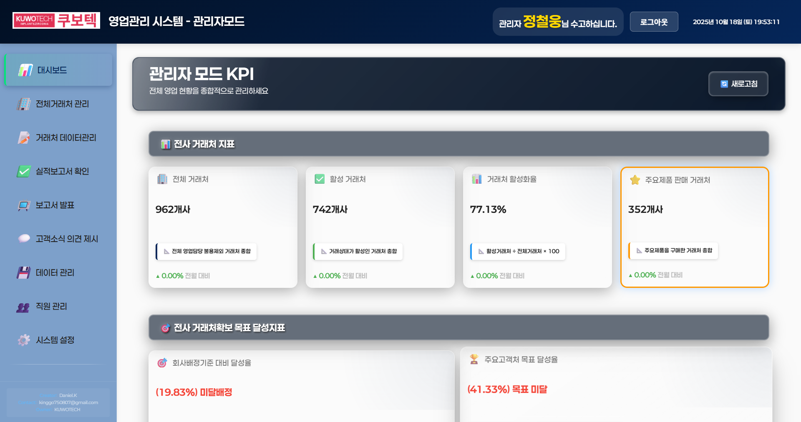

# KUWOTECH 영업관리 시스템 - 관리자모드 사용자 매뉴얼

**작성일:** 2025년 10월 18일
**대상:** 관리자
**시스템:** KUWOTECH 영업관리 시스템

---

## 목차

1. [로그인](#1-로그인)
2. [대시보드](#2-대시보드)
3. [전체거래처 관리](#3-전체거래처-관리)
4. [거래처 데이터관리](#4-거래처-데이터관리)
5. [실적보고서 확인](#5-실적보고서-확인)
6. [보고서 발표](#6-보고서-발표)
7. [고객소식 의견 제시](#7-고객소식-의견-제시)
8. [데이터 관리](#8-데이터-관리)
9. [직원 관리](#9-직원-관리)
10. [시스템 설정](#10-시스템-설정)

---

## 1. 로그인

### 사용 목적
영업관리 시스템에 관리자 계정으로 접속하여 전사 데이터를 관리합니다.

### 페이지 유형
**입력 페이지**

### 사용 방법

1. **성명 입력**
   - 로그인 페이지에서 관리자 성명을 입력합니다.
   - 입력 후 Enter 키를 누르거나 입력란에서 포커스를 이동합니다.

2. **역할 확인**
   - 시스템이 자동으로 "관리자" 역할을 선택합니다.
   - 관리자 권한이 확인되면 역할이 표시됩니다.

3. **비밀번호 입력**
   - 비밀번호 입력란에 비밀번호를 입력합니다.
   - 관리자 비밀번호는 별도로 관리되어야 합니다.

4. **로그인**
   - "확인" 버튼을 클릭하여 로그인합니다.
   - 로그인 성공 시 관리자 대시보드로 이동합니다.

### 주의사항
- 관리자 계정은 보안상 중요하므로 비밀번호를 주기적으로 변경하세요.
- 관리자 권한이 없는 계정으로는 로그인할 수 없습니다.
- 중복 로그인 시 기존 세션 종료 여부를 선택할 수 있습니다.

---

## 2. 대시보드

### 사용 목적
전사 영업 실적 현황을 종합적으로 확인할 수 있는 관리자 전용 KPI 대시보드입니다.

### 페이지 유형
**조회 전용 페이지**

---

### 📊 대시보드 보는 방법

#### 1단계: 대시보드 접속
- 로그인 후 자동으로 관리자 대시보드가 표시됩니다.
- 또는 좌측 사이드바에서 "📊 대시보드" 메뉴를 클릭합니다.

*▲ 관리자 대시보드 전체 화면 - 전사 KPI를 4개 섹션으로 확인할 수 있습니다*

#### 2단계: KPI 카드 확인
관리자 대시보드는 4개의 주요 섹션으로 구성되어 있습니다:

---

### 📊 전사 거래처 지표 (섹션 1)

전체 영업담당자의 거래처 현황을 종합적으로 확인할 수 있습니다.

**🏢 전체 거래처**
- **의미**: 전체 영업담당의 불용제외 거래처 종합
- **보는 방법**: 큰 숫자로 표시된 전체 거래처 수를 확인합니다.
- **활용**: 회사 전체가 관리하는 거래처 규모를 파악합니다.
- **전월 대비**: ▲ 또는 ▼ 아이콘과 함께 증감율이 표시됩니다.

**✅ 활성 거래처**
- **의미**: 거래상태가 활성인 거래처 총합
- **보는 방법**: 녹색으로 강조된 숫자를 확인합니다.
- **활용**: 실제로 거래가 발생하는 거래처 수를 파악합니다.

**📊 거래처 활성화율**
- **의미**: (활성거래처 ÷ 전체거래처) × 100
- **계산식**: 활성거래처 ÷ 전체거래처 × 100
- **보는 방법**: 퍼센트(%) 값을 확인합니다.
- **목표**: 80% 이상 유지가 바람직합니다.
- **활용**: 전사 거래처 관리 효율성을 평가합니다.

**⭐ 주요제품 판매 거래처**
- **의미**: 주요제품을 구매한 거래처 총합
- **보는 방법**: 숫자로 표시된 거래처 수를 확인합니다.
- **활용**: 핵심 제품의 시장 침투율을 파악합니다.

---

### 🎯 전사 거래처확보 목표 달성지표 (섹션 2)

회사 전체의 거래처 확보 목표 달성도를 확인할 수 있습니다.

**🎯 회사배정기준 대비 달성율**
- **의미**: ((전체거래처 ÷ (80 × 영업담당자수)) - 1) × 100
- **계산식**: ((전체거래처 ÷ (80 × 영업담당자수)) - 1) × 100
- **보는 방법**: 퍼센트(%) 값과 달성/미달 상태를 확인합니다.
- **목표**: 100% 이상 달성이 목표입니다.
- **활용**: 영업담당자당 거래처 확보 목표 달성도를 평가합니다.

**🏆 주요고객처 목표 달성율**
- **의미**: ((주요제품판매거래처 ÷ (40 × 영업담당자수)) - 1) × 100
- **계산식**: ((주요제품판매거래처 ÷ (40 × 영업담당자수)) - 1) × 100
- **보는 방법**: 퍼센트(%) 값과 달성/미달 상태를 확인합니다.
- **목표**: 100% 이상 달성이 목표입니다.
- **활용**: 주요 고객 확보 목표 달성도를 평가합니다.

---

### 💰 전사 매출 지표 (섹션 3)

회사 전체의 매출 현황을 종합적으로 확인할 수 있습니다.

**💰 누적 매출금액**
- **의미**: ∑(전체 영업담당 누적매출)
- **계산식**: 전체 영업담당의 누적매출 합계
- **보는 방법**: 큰 숫자로 표시된 매출금액을 확인합니다.
- **활용**: 전사 매출 규모를 파악합니다.

**💳 누적 수금금액**
- **의미**: ∑(전체 영업담당 누적수금)
- **계산식**: 전체 영업담당의 누적수금 합계
- **보는 방법**: 숫자로 표시된 수금금액을 확인합니다.
- **활용**: 실제 현금 유입 규모를 파악합니다.

**📋 매출채권 잔액**
- **의미**: 전사 누적매출 - 전사 누적수금
- **계산식**: 전사 누적매출 - 전사 누적수금
- **보는 방법**: 숫자로 표시된 잔액을 확인합니다.
- **활용**: 미수금 관리가 필요한 금액을 파악합니다.

**💎 주요제품 매출액**
- **의미**: ∑(전체 영업담당 주요제품매출)
- **계산식**: 전체 영업담당의 주요제품매출 합계
- **보는 방법**: 숫자로 표시된 매출액을 확인합니다.
- **활용**: 핵심 제품의 매출 기여도를 파악합니다.

**📈 매출 집중도**
- **의미**: (전사 누적매출금액 ÷ 전사 담당거래처) ÷ 현재월수
- **계산식**: (전사 누적매출금액 ÷ 전사 담당거래처) ÷ 현재월수
- **보는 방법**: 거래처당 평균 월매출액을 확인합니다.
- **활용**: 거래처별 매출 효율성을 평가합니다.

**📊 주요제품 매출비율**
- **의미**: 전사 주요제품매출 ÷ 전사 누적매출 × 100
- **계산식**: 전사 주요제품매출 ÷ 전사 누적매출 × 100
- **보는 방법**: 퍼센트(%) 값을 확인합니다.
- **활용**: 주요제품의 매출 기여도를 평가합니다.

---

### 📈 전사 기여도 지표 (섹션 4)

영업담당자별 기여도를 확인할 수 있습니다.

**🌟 전체매출 기여도**
- **의미**: 영업담당자별 전체매출 순위
- **보는 방법**: "상세보기" 버튼을 클릭하여 순위를 확인합니다.
- **활용**: 영업담당자별 성과를 비교 평가합니다.

**⭐ 주요제품매출 기여도**
- **의미**: 영업담당자별 주요제품매출 순위
- **보는 방법**: "상세보기" 버튼을 클릭하여 순위를 확인합니다.
- **활용**: 핵심 제품 판매 성과를 비교 평가합니다.

**📊 매출집중도 상세**
- **의미**: 영업담당자별 매출집중도 상세 데이터
- **보는 방법**: "상세보기" 버튼을 클릭하여 데이터를 확인합니다.
- **활용**: 거래처별 매출 효율성을 담당자별로 비교합니다.

---

### 주의사항
- 대시보드의 데이터는 실시간으로 업데이트되지 않습니다. "🔄 새로고침" 버튼을 클릭하여 최신 데이터를 확인하세요.
- 모든 금액은 VAT 포함 금액입니다.
- 전월 대비 증감율은 직전 월과의 비교 데이터입니다.

---

## 3. 전체거래처 관리

### 사용 목적
전체 거래처 정보를 조회하고 관리할 수 있는 페이지입니다.

### 페이지 유형
**조회 및 입력 페이지**

---

### 📊 전체거래처 관리 보는 방법

#### 1단계: 전체거래처 관리 페이지 접속
좌측 사이드바에서 "🏢 전체거래처 관리" 메뉴를 클릭합니다.

*▲ 전체거래처 관리 화면 - 전체 거래처 목록과 필터를 확인할 수 있습니다*

#### 2단계: 거래처 조회
- **필터 사용**: 내부담당자, 담당부서, 거래처명, 거래상태, 판매제품, 고객사 지역 필터를 사용하여 원하는 거래처를 검색합니다.
- **검색**: 거래처명 입력란에 검색어를 입력하여 거래처를 찾습니다.
- **검색 버튼**: 🔍 검색 버튼을 클릭하여 필터 조건에 맞는 거래처를 조회합니다.

*▲ 필터 기능 - 다양한 조건으로 거래처를 검색할 수 있습니다*

#### 3단계: 거래처 목록 확인
거래처 목록 테이블에서 다음 정보를 확인할 수 있습니다:
- **내부담당자**: 담당 영업사원
- **담당부서**: 영업부서
- **거래처명**: 거래처 회사명
- **대표이사**: 대표자명
- **고객사 지역**: 거래처 소재지
- **거래상태**: 활성/비활성 상태
- **판매제품**: 주요 판매 제품
- **마지막접촉일**: 최근 접촉 날짜
- **마지막접촉결과금액**: 최근 거래 금액
- **누적매출금액**: 총 매출액
- **누적수금액**: 총 수금액

#### 4단계: 거래처 추가 (관리자 전용)

*▲ 거래처 추가 화면 - 신규 거래처를 등록할 수 있습니다*

1. **거래처 추가 버튼 클릭**
   - 우측 상단의 "+ 거래처 추가" 버튼을 클릭합니다.

2. **기본 정보 입력**
   - **최초거래처명**: 거래처 회사명을 입력합니다 (필수)
   - **사업자등록번호**: 사업자등록번호를 입력합니다
   - **대표이사/지점이사**: 대표자명을 입력합니다
   - **전화번호**: 전화번호를 입력합니다

3. **저장**
   - "저장" 버튼을 클릭하여 거래처를 등록합니다.
   - "취소" 버튼을 클릭하면 입력한 내용이 저장되지 않습니다.

---

### 거래처 목록 통계

거래처 목록 상단에는 전체 거래처 통계가 표시됩니다:
- **총 거래처 수**: 전체 거래처 개수
- **누적매출금액합계**: 전체 거래처의 누적매출 합계
- **누적수금금액합계**: 전체 거래처의 누적수금 합계
- **매출채권잔액합계**: 미수금 총액 (빨간색으로 표시)

---

### 주의사항
- 거래처 추가 시 최초거래처명은 필수 입력 항목입니다.
- 거래처 수정 및 삭제는 담당 영업담당자만 가능합니다.
- 필터 조건은 여러 개를 동시에 사용할 수 있습니다.

---

## 4. 거래처 데이터관리

### 사용 목적
전체 거래처의 데이터 완성도를 확인하고 관리할 수 있는 페이지입니다.

### 페이지 유형
**조회 전용 페이지**

---

### 📊 거래처 데이터관리 보는 방법

#### 1단계: 거래처 데이터관리 페이지 접속
좌측 사이드바에서 "📝 거래처 데이터관리" 메뉴를 클릭합니다.

*▲ 거래처 데이터관리 화면 - 전체 거래처의 데이터 완성도를 확인할 수 있습니다*

#### 2단계: 데이터 완성도 카드 확인

관리자는 전체 거래처의 데이터 완성도를 8개 항목으로 확인할 수 있습니다:

**🏢 최초거래처명**
- **의미**: 거래처명이 입력된 비율
- **보는 방법**: 입력된 거래처 수 / 전체 거래처 수
- **완성율**: 퍼센트(%) 값으로 표시
- **활용**: 거래처 기본 정보 입력 상태를 파악합니다.

**🚫 폐업여부**
- **의미**: 폐업 상태가 확인된 비율
- **보는 방법**: 입력된 거래처 수 / 전체 거래처 수
- **완성율**: 퍼센트(%) 값으로 표시
- **활용**: 거래처 영업 상태를 파악합니다.

**👔 대표이사/지점이사**
- **의미**: 대표자명이 입력된 비율
- **보는 방법**: 입력된 거래처 수 / 전체 거래처 수
- **완성율**: 퍼센트(%) 값으로 표시
- **활용**: 거래처 책임자 정보 입력 상태를 파악합니다.

**📄 사업자등록번호**
- **의미**: 사업자등록번호가 입력된 비율
- **보는 방법**: 입력된 거래처 수 / 전체 거래처 수
- **완성율**: 퍼센트(%) 값으로 표시
- **활용**: 거래처 법인 정보 입력 상태를 파악합니다.

**📞 전화번호**
- **의미**: 전화번호가 입력된 비율
- **보는 방법**: 입력된 거래처 수 / 전체 거래처 수
- **완성율**: 퍼센트(%) 값으로 표시
- **활용**: 거래처 연락처 정보 입력 상태를 파악합니다.

**📍 상세주소**
- **의미**: 상세주소가 입력된 비율
- **보는 방법**: 입력된 거래처 수 / 전체 거래처 수
- **완성율**: 퍼센트(%) 값으로 표시
- **활용**: 거래처 위치 정보 입력 상태를 파악합니다.

**🗺️ 고객사지역**
- **의미**: 고객사 지역이 입력된 비율
- **보는 방법**: 입력된 거래처 수 / 전체 거래처 수
- **완성율**: 퍼센트(%) 값으로 표시
- **활용**: 거래처 지역 정보 입력 상태를 파악합니다.

**🗺️ 시/도 지역**
- **의미**: 시/도 지역이 입력된 비율
- **보는 방법**: 입력된 거래처 수 / 전체 거래처 수
- **완성율**: 퍼센트(%) 값으로 표시
- **활용**: 거래처 광역 지역 정보 입력 상태를 파악합니다.

---

### 주의사항
- 데이터 완성도는 전체 거래처 수 대비 입력된 거래처 수의 비율입니다.
- 완성도가 낮은 항목은 영업담당자에게 데이터 입력을 독려해야 합니다.
- 거래처 데이터는 담당 영업담당자가 직접 입력하고 수정합니다.

---

## 5. 실적보고서 확인

### 사용 목적
영업담당자가 제출한 실적보고서를 확인하고 검토할 수 있는 페이지입니다.

### 페이지 유형
**조회 및 검토 페이지**

---

### 📊 실적보고서 확인 방법

#### 1단계: 실적보고서 확인 페이지 접속
좌측 사이드바에서 "✅ 실적보고서 확인" 메뉴를 클릭합니다.

*▲ 실적보고서 확인 화면 - 제출된 실적보고서를 확인하고 검토할 수 있습니다*

#### 2단계: 제출 현황 확인

좌측 패널에서 전체 실적보고서 제출 현황을 확인할 수 있습니다:

**✅ 금주 실적보고서 제출현황**
- **제출자**: 제출한 영업담당자 목록
- **미제출자**: 아직 제출하지 않은 영업담당자 목록
- **제출 인원**: 제출자 수가 표시됩니다

**📍 보고서 상태**
- **✅ 미실행 (XX명)**: 미실행 상태의 보고서 수
- **❌ 미제출 (XX명)**: 미제출 상태의 보고서 수

#### 3단계: 금주 실적보고서 목록 확인

중앙 패널에서 제출된 실적보고서 목록을 확인할 수 있습니다:

각 보고서 카드에는 다음 정보가 표시됩니다:
- **주간**: 보고서 대상 주차
- **❌ 미실행 / ✅ 제출**: 보고서 상태
- **담당자명**: 보고서 작성자
- **제출일**: 보고서 제출 날짜
- **거래처명**: 보고서 대상 거래처

#### 4단계: 보고서 상세 확인

1. **보고서 카드 클릭**
   - 확인하고자 하는 보고서 카드를 클릭합니다.

2. **상세 내용 확인**
   - 우측 패널에 보고서 상세 내용이 표시됩니다.
   - 영업담당자가 작성한 활동 내용을 확인합니다.

3. **검토 및 피드백**
   - 보고서 내용을 검토합니다.
   - 필요 시 영업담당자에게 피드백을 제공합니다.

---

### 주의사항
- 실적보고서는 매주 제출되어야 합니다.
- 미제출자는 별도로 관리하여 제출을 독려해야 합니다.
- 보고서 상세 내용은 선택한 보고서만 표시됩니다.

---

## 6. 보고서 발표

### 사용 목적
영업담당자별 실적보고서를 발표 형식으로 확인할 수 있는 페이지입니다.

### 페이지 유형
**조회 전용 페이지**

---

### 📊 보고서 발표 보는 방법

#### 1단계: 보고서 발표 페이지 접속
좌측 사이드바에서 "📺 보고서 발표" 메뉴를 클릭합니다.

*▲ 보고서 발표 화면 - 3가지 보고서 유형을 확인할 수 있습니다*

#### 2단계: 보고서 유형 선택

보고서 발표는 3가지 유형으로 구성되어 있습니다:

**👤 실적보고(개인별)**
- **의미**: 영업담당자별 개인 실적 보고서
- **기능**:
  - **상세보기**: 개인별 상세 실적을 확인합니다
  - **접기**: 보고서 목록을 접습니다
- **활용**: 개별 영업담당자의 성과를 평가합니다

**📊 실적보고(상세)**
- **의미**: 전체 영업담당자의 상세 실적 비교 보고서
- **기능**:
  - **상세보기**: 전체 상세 실적을 확인합니다
  - **접기**: 보고서 목록을 접습니다
- **활용**: 영업담당자 간 성과를 비교 분석합니다

**📅 최종결제일 보고**
- **의미**: 거래처별 최종 결제일 현황 보고서
- **기능**:
  - **상세보기**: 결제일 상세 데이터를 확인합니다
  - **접기**: 보고서 목록을 접습니다
- **활용**: 수금 관리 및 매출채권 현황을 파악합니다

#### 3단계: 보고서 확인

1. **상세보기 버튼 클릭**
   - 원하는 보고서 유형의 "상세보기" 버튼을 클릭합니다.

2. **데이터 확인**
   - 펼쳐진 보고서에서 상세 데이터를 확인합니다.
   - 표 형식으로 정리된 데이터를 분석합니다.

3. **접기**
   - "접기" 버튼을 클릭하여 보고서를 닫습니다.

---

### 주의사항
- 보고서 데이터는 최신 제출 기준으로 표시됩니다.
- 여러 보고서를 동시에 펼쳐서 비교할 수 있습니다.
- 보고서는 인쇄 또는 PDF로 저장할 수 있습니다.

---

## 7. 고객소식 의견 제시

### 사용 목적
영업담당자가 작성한 고객소식을 확인하고 의견을 제시할 수 있는 페이지입니다.

### 페이지 유형
**조회 및 입력 페이지**

---

### 📊 고객소식 의견제시 사용 방법

#### 1단계: 고객소식 의견제시 페이지 접속
좌측 사이드바에서 "💬 고객소식 의견 제시" 메뉴를 클릭합니다.

*▲ 고객소식 의견제시 화면 - 검색 필터를 사용하여 고객소식을 조회할 수 있습니다*

#### 2단계: 고객소식 검색

검색 필터를 사용하여 원하는 고객소식을 찾을 수 있습니다:

**검색 조건**
- **거래처명**: 거래처명을 입력하여 검색 (자동완성 지원)
- **내부담당자**: 담당 영업사원을 선택하여 검색
- **시작일 ~ 종료일**: 날짜 범위를 지정하여 검색
- **카테고리**: 고객소식 카테고리를 선택하여 검색
- **🔍 검색**: 검색 버튼을 클릭하여 조회

#### 3단계: 고객소식 목록 확인

검색 결과로 고객소식 목록이 표시됩니다:
- **거래처명**: 고객소식 대상 거래처
- **담당자**: 작성한 영업담당자
- **작성일**: 고객소식 작성 날짜
- **카테고리**: 고객소식 분류
- **제목**: 고객소식 제목
- **내용**: 고객소식 내용 요약

#### 4단계: 의견 제시

1. **고객소식 선택**
   - 의견을 제시하고자 하는 고객소식을 클릭합니다.

2. **상세 내용 확인**
   - 고객소식의 전체 내용을 확인합니다.

3. **의견 작성**
   - 관리자 의견 입력란에 피드백을 작성합니다.

4. **의견 저장**
   - "저장" 버튼을 클릭하여 의견을 제출합니다.

---

### 주의사항
- 검색 조건을 조합하여 원하는 고객소식을 빠르게 찾을 수 있습니다.
- 관리자 의견은 영업담당자가 확인할 수 있습니다.
- 의견 제시 후 영업담당자에게 알림이 전송됩니다.

---

## 8. 데이터 관리

### 사용 목적
시스템 데이터를 백업하고 관리할 수 있는 관리자 전용 페이지입니다.

### 페이지 유형
**관리 페이지**

---

### 📊 데이터 관리 사용 방법

#### 1단계: 데이터 관리 페이지 접속
좌측 사이드바에서 "💾 데이터 관리" 메뉴를 클릭합니다.

*▲ 데이터 관리 화면 - 3가지 데이터 다운로드 기능을 제공합니다*

#### 2단계: 데이터 다운로드

데이터 관리는 3가지 다운로드 기능을 제공합니다:

**🏢 전체거래처 관리**
- **의미**: 전체 거래처 정보를 엑셀 파일로 다운로드
- **데이터**:
  - 총 거래처: 962개
  - 마지막 업데이트: 2025년 10월 18일
- **사용 방법**:
  1. "💾 다운로드" 버튼을 클릭합니다.
  2. 엑셀 파일이 다운로드됩니다.
- **활용**: 거래처 정보 백업, 외부 분석

**👤 영업담당 KPI**
- **의미**: 영업담당자별 KPI 데이터를 엑셀 파일로 다운로드
- **데이터**:
  - 담당자 선택: 드롭다운에서 담당자를 선택합니다
- **사용 방법**:
  1. 담당자를 선택합니다.
  2. "💾 다운로드" 버튼을 클릭합니다.
  3. 선택한 담당자의 KPI 데이터가 다운로드됩니다.
- **활용**: 개별 성과 분석, 평가 자료

**📊 회사전체 KPI**
- **의미**: 전사 KPI 데이터를 엑셀 파일로 다운로드
- **데이터**:
  - 총 영업담당자: 16명
  - 기준일: 2025년 10월 18일
- **사용 방법**:
  1. "💾 다운로드" 버튼을 클릭합니다.
  2. 전사 KPI 데이터가 다운로드됩니다.
- **활용**: 전사 성과 분석, 경영 보고

---

### 주의사항
- 다운로드된 엑셀 파일은 민감한 정보를 포함하므로 보안에 유의하세요.
- 데이터 백업은 정기적으로 수행하는 것이 좋습니다.
- 엑셀 파일은 최신 버전의 Excel에서 열 수 있습니다.

---

## 9. 직원 관리

### 사용 목적
직원 정보를 관리하고 권한을 설정할 수 있는 관리자 전용 페이지입니다.

### 페이지 유형
**관리 페이지**

---

### 📊 직원 관리 사용 방법

#### 1단계: 직원 관리 페이지 접속
좌측 사이드바에서 "👥 직원 관리" 메뉴를 클릭합니다.

*▲ 직원 관리 화면 - 직원 현황과 직원 목록을 확인할 수 있습니다*

#### 2단계: 직원 통계 확인

**👥 직원 통계**

상단에는 전체 직원 현황이 표시됩니다:
- **👥 전체 직원**: 19명 - 전체 등록된 직원 수
- **💼 영업 직원**: 16명 - 영업 업무를 수행하는 직원 수
- **👨‍💼 관리자**: 5명 - 관리자 권한을 가진 직원 수
- **✅ 활성 계정**: 18명 - 현재 활성화된 계정 수

#### 3단계: 직원 등록

**👤 관리 도구**

1. **+ 직원 추가 버튼**
   - "직원 추가" 버튼을 클릭합니다.
   - 신규 직원 정보 입력 폼이 표시됩니다.

2. **직원 정보 입력**
   - 이름, 이메일, 전화번호 등을 입력합니다.
   - 역할(영업담당/관리자)을 선택합니다.
   - 부서 정보를 선택합니다.

3. **저장**
   - "저장" 버튼을 클릭하여 직원을 등록합니다.

**기타 기능**
- **✅ 일괄 등록**: 엑셀 파일로 여러 직원을 한번에 등록합니다.
- **📋 내보내기**: 직원 목록을 엑셀 파일로 다운로드합니다.

#### 4단계: 직원 목록 관리

**📋 직원 목록**

직원 목록 테이블에서 다음 정보를 확인할 수 있습니다:
- **□**: 선택 체크박스
- **이름**: 직원 이름
- **부서**: 소속 부서
- **입사일**: 입사 날짜
- **전화번호**: 연락처
- **이메일**: 이메일 주소
- **담당거래처**: 담당 거래처 수
- **상태**: 재직/퇴사 상태
- **작업**: 수정/삭제 버튼

#### 5단계: 직원 정보 수정

1. **수정 버튼 클릭**
   - 수정하고자 하는 직원의 "작업" 열에서 수정 버튼을 클릭합니다.

2. **정보 수정**
   - 직원 정보 수정 폼이 표시됩니다.
   - 필요한 정보를 수정합니다.

3. **저장**
   - "저장" 버튼을 클릭하여 변경사항을 저장합니다.

---

### 주의사항
- 직원 삭제 시 해당 직원의 모든 데이터가 영구적으로 삭제될 수 있습니다.
- 관리자 권한 부여 시 신중하게 결정해야 합니다.
- 퇴사 처리 시 담당 거래처를 다른 영업담당자에게 이관해야 합니다.

---

## 10. 시스템 설정

### 사용 목적
본인 정보를 변경하고 비밀번호를 관리할 수 있는 페이지입니다.

### 페이지 유형
**설정 페이지**

---

### 📊 시스템 설정 사용 방법

#### 1단계: 시스템 설정 페이지 접속
좌측 사이드바에서 "⚙️ 시스템 설정" 메뉴를 클릭합니다.

*▲ 시스템 설정 화면 - 본인 정보 변경과 비밀번호 변경을 할 수 있습니다*

#### 2단계: 본인 정보 변경

**👤 본인 정보 변경**

다음 정보를 변경할 수 있습니다:

1. **이름**
   - 현재 이름이 표시됩니다 (예: 정철웅)
   - 이름 변경이 필요한 경우 입력합니다.

2. **이메일**
   - 이메일 주소를 입력합니다.
   - 형식: "이메일 주소를 입력하세요"

3. **전화번호**
   - 전화번호를 입력합니다.
   - 형식: 010-0000-0000

4. **부서**
   - 드롭다운에서 소속 부서를 선택합니다.
   - 현재 부서가 기본으로 선택되어 있습니다.

5. **저장**
   - 정보 변경 후 "저장" 버튼을 클릭합니다.

#### 3단계: 비밀번호 변경

**🔒 비밀번호 변경**

비밀번호를 변경하려면:

1. **현재 비밀번호 입력**
   - "현재 비밀번호 입력" 란에 현재 사용 중인 비밀번호를 입력합니다.

2. **새 비밀번호 입력**
   - "새 비밀번호 입력" 란에 변경할 비밀번호를 입력합니다.
   - 비밀번호는 8자 이상, 영문/숫자/특수문자 조합을 권장합니다.

3. **새 비밀번호 확인**
   - "새 비밀번호 재입력" 란에 동일한 비밀번호를 다시 입력합니다.
   - 두 비밀번호가 일치해야 합니다.

4. **비밀번호 변경**
   - "변경" 버튼을 클릭하여 비밀번호를 변경합니다.

---

### 주의사항
- 비밀번호는 정기적으로 변경하는 것이 좋습니다.
- 비밀번호 변경 시 현재 비밀번호를 정확히 입력해야 합니다.
- 새 비밀번호는 안전한 비밀번호 규칙을 따라 설정하세요.
- 비밀번호 변경 후 재로그인이 필요할 수 있습니다.

---

## 부록

### 용어 정의

- **전사**: 회사 전체
- **누적매출**: 기간 누적 매출액 (VAT 포함)
- **누적수금**: 기간 누적 수금액
- **매출채권**: 매출은 발생했으나 아직 수금하지 못한 금액
- **활성 거래처**: 거래상태가 활성인 거래처
- **주요제품**: 회사의 핵심 판매 제품
- **매출 집중도**: 거래처당 평균 월매출액
- **KPI**: Key Performance Indicator (핵심성과지표)

### 문의처

시스템 사용 중 문의사항이 있으시면 아래로 연락주세요:

- **개발자**: Daniel.K
- **이메일**: kinggo750807@gmail.com
- **소유자**: KUWOTECH

---

**문서 버전**: 1.0
**최종 수정일**: 2025년 10월 18일
